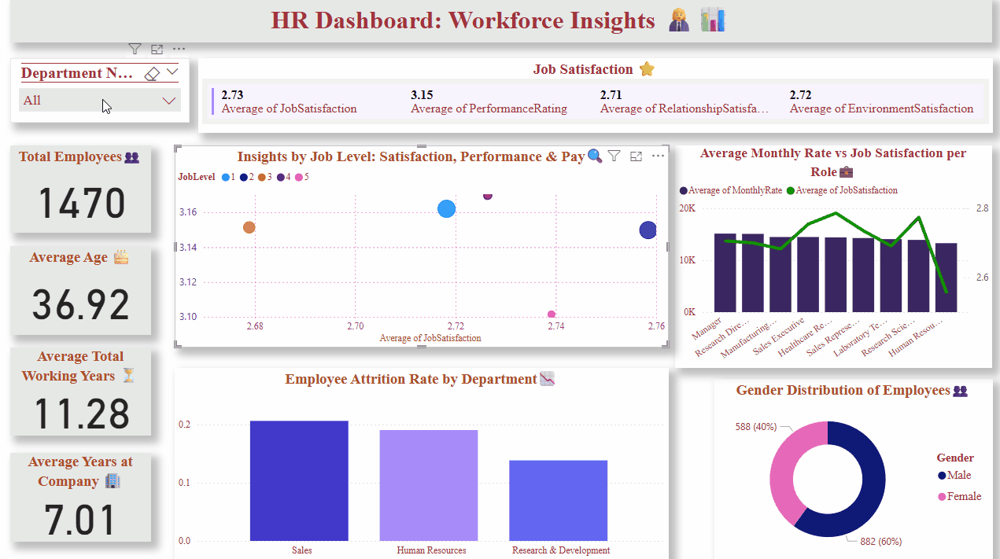

## Overview ##
This project presents a comprehensive HR analytics dashboard built using Power BI to provide insights into employee data such as satisfaction, performance, salaries, attrition, and demographics. It is designed to help HR professionals and decision-makers make data-driven workforce strategies.
##  Dashboard Highlights ##
Total Employees
- Monitor the size of the workforce.

Average Age
- Understand the employee age distribution.

Average Working Years
- Evaluate employee experience levels.

Average Years at Company
- Measure employee loyalty and retention.

Attrition Rate by Department
- Identify departments with high employee turnover.

Average Monthly Rate vs Job Satisfaction (by Role)
- Analyze compensation relative to employee satisfaction.

Job Level Insights Including:

- Average Job Satisfaction

- Average Performance Rating

- Hourly Pay

- Total Employees per Job Level

- Satisfaction Indicators

- Job Satisfaction

- Performance Rating

- Relationship Satisfaction

- Environment Satisfaction

Gender Distribution
- Visualized breakdown of male vs. female employees.

## Tools Used ##
- Power BI – for interactive data visualization
- Microsoft Excel – for data preparation
- DAX – for custom measures

## Demo ##

🔹 Dashboard Preview

## Dataset Source ##
This dataset is publicly available on Kaggle, and was used solely for educational and visualization purposes.

## Conclusion ##

This interactive Power BI dashboard provides a detailed breakdown of key HR metrics across various departments. By visualizing insights like employee satisfaction, performance, attrition rates, and compensation levels, it helps HR teams and decision-makers:

-Identify areas needing improvement
-Monitor workforce trends
-Support data-driven decision making
-Enhance overall workplace environment
The dashboard’s department-level granularity ensures focused analysis that can support targeted actions and strategic planning.

